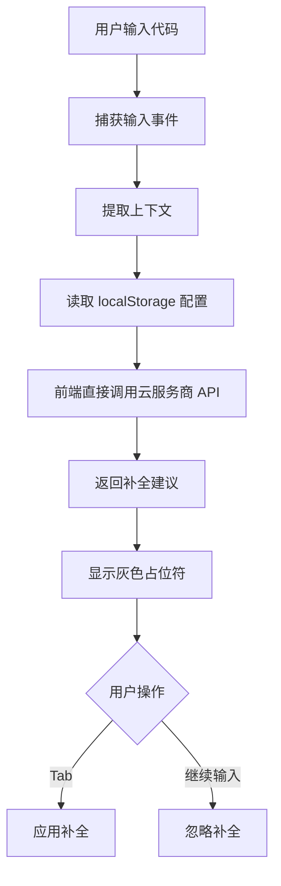
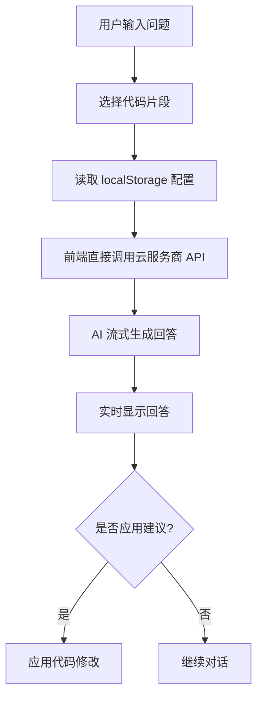

# 网页版 Copilot - PRD 文档

## 1. Product Overview

基于 Monaco Editor 的纯前端网页版 AI 代码助手，为开发者提供智能代码补全、代码解释、重构建议等功能，支持多种编程语言，前端直接调用云服务商 API，无需后端中转。

- **核心目标**：在浏览器中提供类似 GitHub Copilot 的 AI 辅助编程体验，纯前端实现
- **目标用户**：开发者、编程学习者、远程协作团队
- **市场价值**：无需安装、无需部署后端、跨平台、随时随地使用的 AI 编程辅助工具

## 2. Core Features

### 2.1 User Roles

| Role | Registration Method | Core Permissions |
|------|---------------------|------------------|
| 用户 | 配置 API Key | 使用所有功能，消耗自己的 API 额度 |

### 2.2 Feature Module

1. **代码编辑器页面**：Monaco Editor 代码编辑、AI 补全、快捷键操作
2. **AI 聊天面板**：代码解释、重构建议、问题解答
3. **文件管理面板**：新建、打开、保存代码文件（localStorage）
4. **设置面板**：云服务商 API Key 配置、模型选择、主题设置

### 2.3 Page Details

| Page Name | Module Name | Feature description |
|-----------|-------------|---------------------|
| 代码编辑器页面 | Monaco Editor | 支持多种编程语言语法高亮、代码折叠、行号显示 |
| 代码编辑器页面 | AI 代码补全 | 实时补全建议、Tab 键接受补全、Ctrl+Space 触发补全，前端直接调用云服务商 API |
| AI 聊天面板 | 对话界面 | 与 AI 对话，发送代码片段，获取解释和建议 |
| AI 聊天面板 | 代码操作 | 一键应用 AI 建议的代码修改 |
| 文件管理面板 | 文件列表 | 显示当前会话的文件列表（localStorage 存储） |
| 文件管理面板 | 文件操作 | 新建、重命名、删除文件 |
| 设置面板 | API 配置 | 配置 OpenAI/阿里云/腾讯云等云服务商 API Key |
| 设置面板 | 模型选择 | 选择不同的 AI 模型（gpt-4o, gpt-4, gpt-3.5-turbo 等） |
| 设置面板 | 主题设置 | 编辑器主题切换、字体大小调整 |

## 3. Core Process

### 3.1 代码补全流程

1. 用户在编辑器中输入代码
2. 系统捕获输入事件，提取上下文（当前文件内容、光标位置）
3. 从 localStorage 读取配置的 API Key 和模型
4. 前端直接调用云服务商 API 获取补全建议
5. 在编辑器中以灰色占位符形式显示补全内容
6. 用户按 Tab 键接受补全，或继续输入忽略

### 3.2 AI 对话流程

1. 用户在聊天面板输入问题或选择代码片段
2. 从 localStorage 读取配置的 API Key 和模型
3. 前端直接调用云服务商 API（流式响应）
4. AI 返回答案或代码建议（实时显示）
5. 用户查看答案，可选择应用代码建议

## 4. User Interface Design

### 4.1 Design Style

- **主色调**：深蓝色系 (#0F172A)，专业科技感
- **辅助色**：绿色 (#10B981) 用于 AI 相关元素，紫色 (#8B5CF6) 用于强调
- **按钮风格**：圆角矩形，扁平化设计
- **字体**：等宽字体 (JetBrains Mono) 用于代码编辑，系统字体用于界面
- **布局风格**：三栏布局（文件面板 | 编辑器 | 聊天面板）
- **图标风格**：简洁线性图标，使用 Lucide React

### 4.2 Page Design Overview

| Page Name | Module Name | UI Elements |
|-----------|-------------|-------------|
| 代码编辑器页面 | 顶部导航栏 | Logo、新建文件按钮、保存按钮、设置按钮 |
| 代码编辑器页面 | 文件面板 | 文件树、新建文件、删除文件 |
| 代码编辑器页面 | Monaco Editor | 代码编辑区域、行号、语法高亮、补全提示 |
| 代码编辑器页面 | AI 聊天面板 | 消息列表、输入框、发送按钮 |
| 设置面板 | API 配置 | API Key 输入框（密码隐藏）、云服务商选择、模型选择下拉框 |
| 设置面板 | 主题设置 | 主题切换按钮、字体大小滑块 |

### 4.3 Responsiveness

- **桌面端**：三栏布局，完整功能
- **平板端**：双栏布局，文件面板折叠为侧边抽屉
- **移动端**：单栏布局，面板通过底部标签切换

### 4.4 交互细节

- **补全提示**：实时显示，灰色半透明占位符
- **代码高亮**：语法高亮，错误提示
- **聊天消息**：代码块使用 Monaco Editor 样式渲染，支持语法高亮
- **流式响应**：聊天消息实时逐字显示
- **快捷键**：
  - `Ctrl+Space`：触发代码补全
  - `Ctrl+Enter`：接受补全
  - `Ctrl+/`：注释代码
  - `Ctrl+S`：保存文件

## 5. 支持的云服务商

| 云服务商 | API 类型 | 支持模型 |
|----------|----------|----------|
| OpenAI | Chat Completions | gpt-4o, gpt-4, gpt-4-turbo, gpt-3.5-turbo |
| 阿里云通义千问 | Chat Completions | qwen-turbo, qwen-plus, qwen-max |
| 腾讯云混元大模型 | Chat Completions | hunyuan-pro, hunyuan-standard |
| 字节跳动火山引擎 | Chat Completions | doubao-3-5 |
| 自定义 API | 兼容 OpenAI 格式 | - |

## 6. 安全说明

- **API Key 存储**：API Key 仅存储在浏览器 localStorage 中，不会上传到任何服务器
- **HTTPS 通信**：所有 API 请求通过 HTTPS 传输
- **清除数据**：用户可随时在设置面板清除所有本地存储数据
- **免责声明**：使用前需确认云服务商 API Key 的安全，建议使用限额 API Key